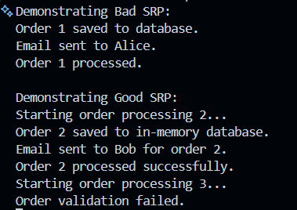

# Лабораторна робота No20
## Тема: SRP: декомпозиція `OrderProcessor.`
## Мета: Застосувати принцип єдиної відповідальності (SRP) для декомпозиції складного класу `OrderProcessor` на менші, більш сфокусовані компоненти.

---

## Завдання
1. Реалізовано початковий клас `OrderProcessor`, що порушує SRP:
   у межах одного класу виконуються різні за змістом операції:
   - перевірка коректності замовлення;
   - імітація збереження в базу даних;
   - Відправляє email сповіщення;
   - зміна статусу замовлення;
2. Виконано рефакторинг для дотримання SRP:
   - Виділено окремі інтерфейси:
     - `IOrderValidator`;
     - `IOrderRepository`;
     - `IEmailService`;
   - Створенно реалізації цих інтерфейсів:
     - `OrderValidator`;
     - `InMemoryOrderRepository`;
     - `ConsoleEmailService`;
   - Розроблено клас-координатор `OrderService`, який отримує залежності через конструктор `(Dependency Injection)` та організовує процес обробки замовлення.
3. Демонстрація роботи:
   - Для валідного замовлення виконується збереження, надсилання email та встановлення статусу `Processed`.
   - Для невалідного замовлення валідація завершується помилкою, статус змінюється на `Cancelled`.

---

## Демонастрація

- Валідне замовлення (`ID=2`) (сума > 0) успішно оброблено за допомогою `OrderService`.
- Невалідне замовлення (`ID=3`) (від’ємна сума) не пройшло перевірку та було скасоване.

---

## Висновок:
- Початковий клас `OrderProcessor` **порушує SRP** — він робить занадто багато дій.  
- Після рефакторингу:
  - Кожен клас виконує **одну відповідальність**.
  - `OrderService` координує роботу компонентів.
- Лабораторна показала правильне застосування **SRP** та **Dependency Injection** для покращення структури коду.