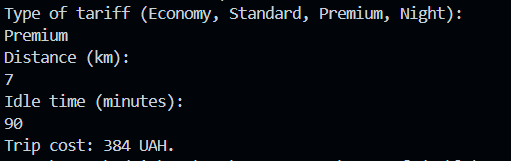

# Лабораторна робота No21
## Тема: OCP: гнучкі алгоритми розрахунку (Factory/Strategy).
## Мета: Застосувати принцип відкритості/закритості (OCP) для створення гнучкої системи розрахунків за допомогою патернів Factory Method та Strategy, забезпечивши можливість легкого додавання нових алгоритмів без зміни існуючого коду.
### Завдання 
Реалізував чотири стратегії страхування:
1. **EconomyStrategy** – економний тариф
2. **StandardStrategy** – стандартний тариф
3. **PremiumStrategy** – преміум тариф
4. **NightStrategy** – нічний тариф 
## Використані патерни
- **Strategy** – для реалізації різних алгоритмів розрахунку вартості поїздки.
- **Factory** – для створення об’єкта стратегії на основі вибору користувача.
## Демонстрація роботи:

- Валідний вибір тарифу обробляється успішно.
- Невірний вибір тарифу виводить повідомлення: `Invalid tariff type`.