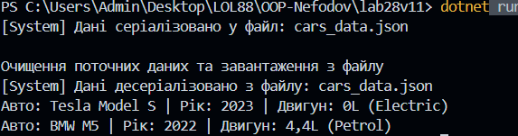

# Лабораторна робота No28
## Тема: Серіалізація об’єктів у JSON.
## Мета: Навчитися серіалізувати та десеріалізувати складні об’єкти у форматі JSON, зберігати дані у файли та завантажувати їх.

Створено проєкт та 3 класи предметної області (Car, Manufacturer, Engine).

Реалізовано репозиторій CarRepository, який використовує System.Text.Json для роботи з даними.

Асинхронність: Методи SaveToFileAsync та LoadFromFileAsync використовують FileStream та await, що забезпечує неблокуючий ввід-вивід.

## Висновок
Програма створює файл cars_data.json, який можна відкрити та переглянути структуру об'єктів у текстовому форматі.