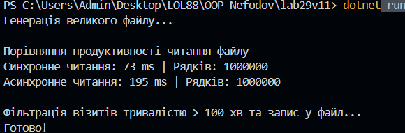

# Лабораторна робота No29
## Тема: Асинхронне читання великих файлів.
## Мета: Навчитися ефективно працювати з великими файлами за допомогою асинхронного потокового читання та запису.

Генератор: Створює файл visits.csv на 1000000 рядків.

Асинхронна обробка: Використано StreamReader з методом ReadLineAsync(), що забезпечує потокову обробку.

Фільтрація: Код виділяє лише ті візити, де користувач перебував на сайті більше 100 хвилин, і записує їх у high_activity_visits.csv.

Продуктивність: У консоль виводиться час виконання обох методів.
