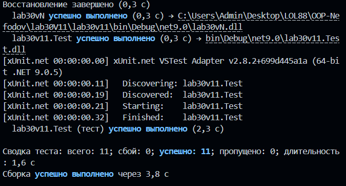

# Лабораторна робота No30
### Тема: Написання юніт-тестів з xUnit.
### Мета: Навчитися писати юніт-тести для власного коду за допомогою xUnit, використовуючи різні типи assertion та параметризовані тести.
За допомогою .NET CLI було створено рішення, що складається з двох проєктів: основного (lab30v11) та тестового (lab30v11.Test). Виконано налаштування зв'язків між проєктами через ProjectReference. 

### Висновок
В ході роботи було опановано практичні навички роботи з фреймворком xUnit, навчено використовувати параметризовані тести для скорочення дублювання коду та перевіряти коректність роботи бізнес-логіки за допомогою різних типів.