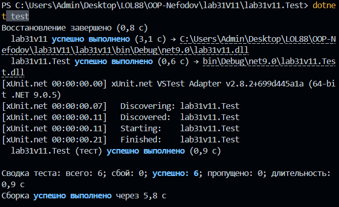

# Лабораторна робота No31
## Тема: Тестування з Moq (мокінг залежностей).
## Мета: Навчитися створювати mock-об’єкти за допомогою Moq для тестування класів з залежностями, використовувати Setup та Verify.
Було створено два проєкти: основну бібліотеку та тестовий проєкт. Через NuGet додано бібліотеку Moq для імітації об'єктів.

Написано 8 тест-кейсів, у яких використано ключові можливості Moq:
1. Setup: Налаштовано поведінку моків (наприклад, _repoMock.Setup повертає true при перевірці існування аккаунта або конкретне значення балансу).
2. Verify: Перевірено, чи викликалися методи залежностей (наприклад, чи викликав сервіс метод UpdateBalance при успішному переказі або LogError при недостатніх коштах).
3. Аргументи: Використано It.IsAny<int>() для гнучкості тестів та перевірку конкретних повідомлень у логах.

## Висновок
В ході лабораторної роботи було опановано техніку мокінгу. Це дозволяє писати швидкі та надійні юніт-тести, які не залежать від зовнішніх факторів, що є критично важливим для великих корпоративних систем.