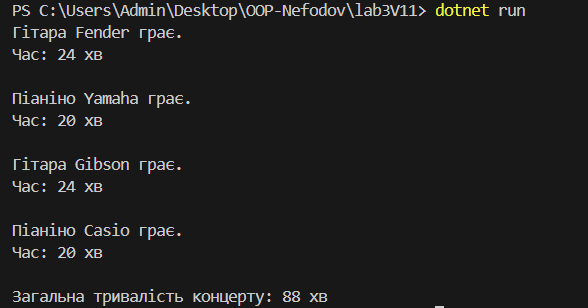

# Лабораторна робота №3. Варіант №11
---
**Тема:** *Наслідування: основи*
**Мета:** *Закріпити знання про базові класи, похідні класи, модифікатори доступу, використання base, поліморфізм у простій формі.
---
## Опис виконаної роботи
---
1. Створив базовий клас `Instrument` з методом `Play()`, а також методами для розрахунку тривалості композиції та кількості композицій.
2. Створив похідні класи `Guitar` та `Piano`, які наслідують `Instrument` і перевизначають методи `Play()`, `GetDuration()` та `GetCount()`.
3. Також головному методі `Main()` створив список інструментів різних типів, використано поліморфізм при виклику методів, а також обчислено загальну тривалість концерту.
- У коді застосовано: **виклик конструктора base(...)**, **virtual/override**, **колекцію об'єктів базового типу**.

---

## Результат роботи

Консольний вивід показує, як кожен інструмент виконує свій метод `Play()`, після чого обчислюється загальний час концерту.

## Висновок
---
Під час виконання лабораторної роботи я закріпив практичні навички роботи з наслідуванням, поліморфізмом, конструктором `base(...)`, а також перевизначенням методів у C#. Робота показала, як через загальний інтерфейс (базовий клас) можна керувати різними об'єктами, які мають різну поведінку.

## Контрольні запитання
---
1. **Що таке наслідування та для чого воно використовується?**  
> Наслідування — це коли один клас (похідний) отримує властивості та методи іншого класу (базового). Воно дозволяє повторно використовувати код і будувати ієрархії об'єктів.

2. **Чим відрізняється virtual від abstract методу?**  
> `virtual` має базову реалізацію і може бути перевизначений.  
> `abstract` не має реалізації — похідний клас обов’язково має реалізувати його.

3. **Як працює ключове слово base?**  
> За допомогою `base` можна звернутися до конструктора або методів базового класу з похідного класу.

4. **Що таке поліморфізм часу виконання?**  
> Це здатність об’єктів поводитися по-різному при виклику одного і того ж методу залежно від фактичного типу об’єкта під час виконання програми.

5. **У чому різниця між композицією та наслідуванням?**  
> Наслідування — це "є" (is-a), композиція — "має" (has-a). Композиція дає більше гнучкості для побудови об'єктів без створення жорстких ієрархій.

---

