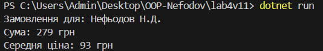

## Лабораторна робота №4

#### Тема: Наслідування, абстракція, інтерфейси, композиція та агрегація
  Мета роботи
Закріпити знання прo наслідування та абстрактні класи, інтерфейси як контракти, різницю між композицією та агрегацією, створення кількох реалізацій через спільний інтерфейс та застосування поліморфізму у практичній задачі.

  #### Опис виконаного завдання

* Було реалізовано предметну область "Кошик товарів";
* Було створено інтерфейс IProduct - контракт для товарів.
* Створено абстрактний клас ProductBase, що частково реалізує інтерфейс.
* Створено два похідні класи: Food, Clothes.
* Клас Cart (кошик товарів) використовує агрегацію - зберігає список товарів, але не "володіє" ними.
* Клас Order (замовник) використовує композицію - сам створює об’єкт Cart і володіє ним.
* Додано клас Customer - покупець, який передається в Order (агрегація).
* Програма показує ініціали замовника та обчислює загальну суму замовлення та середню ціну товару.

### Приклад роботи:

  ### Висновок

У ході виконання роботи я реалізував інтерфейс, абстрактний клас та наслідування, застосував поліморфізм, родемонстрував агрегацію (Cart - Product) та композицію (Order - Cart), закріпив розуміння різниці між інтерфейсом, абстракцією, композицією та наслідуванням.

  ### Контрольні запитання та короткі відповіді

#### 1. У чому різниця між абстрактним класом і інтерфейсом?

Абстрактний клас може мати реалізовані методи та поля.

Інтерфейс містить лише оголошення (без реалізації) - це просто контракт.

#### 2. Коли краще використовувати композицію, а коли наслідування?

Наслідування - коли об’єкт є різновидом іншого (is-a).

Композиція - коли об’єкт має інший усередині (has-a); більш гнучка і замінна.

#### 3. Як працює агрегація і чим вона відрізняється від композиції?

Агрегація - це частина може існувати без цілого.

Композиція - це  частина створюється всередині і не існує окремо.

#### 4. Чи може клас реалізовувати кілька інтерфейсів?
Так, у C# клас може реалізовувати необмежену кількість інтерфейсів.

#### 5. Для чого використовують інтерфейси як “контракти”?
Щоб гарантувати, що клас має певний набір методів / властивостей, незалежно від реалізації.
