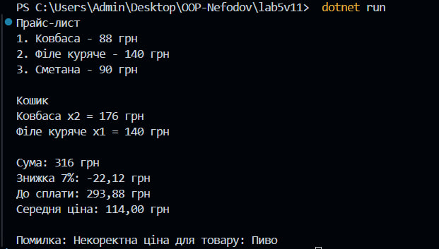

## Лабораторна робота №5

### Тема: Узагальнення (Generics), колекції, LINQ та обробка винятків
    Мета роботи
    Метою є робота з колекціями типу List<T> і Dictionary<TKey, TValue>, застосування LINQ-запитів для фільтрації та пошуку даних, а також створення та обробку власних винятків.

   ### Опис

    Було реалізовано предметну область “Прайс-лист і кошик покупок”, де:
    1. Створено інтерфейс IRepository<T> — контракт для репозиторіїв із базовими методами (Add, Remove, Where, FirstOrDefault, All).
    2. Реалізовано клас Repository<T>, який зберігає дані у колекції List<T> і забезпечує узагальнену роботу з ними.
    3. Створено класи PriceList та CartItem — сутності предметної області, пов’язані через агрегацію (кошик посилається на товари з прайс-листа).
    4. Додано власний виняток InvalidItemException, який виникає під час спроби додати некоректний товар.
    5. У програмі використано LINQ для пошуку та підрахунків (загальна сума, середня ціна, знижка 7%).
    6. Реалізовано демонстрацію роботи з обробкою помилок за допомогою try-catch.
    7. Для зручного виводу результатів використано бібліотеку Spectre.Console.

### Приклад роботи:

   ### Висновок

    У ході виконання лабораторної роботи я закріпив знання з теми узагальнення, колекції та LINQ, створив універсальний репозиторій, реалізував власний виняток та обробку помилок.
    Також продемонстрував використання агрегації між класами PriceList і CartItem.
    Робота допомогла краще зрозуміти, як generics забезпечують типобезпечність і повторне використання коду.

   ## Контрольні запитання 

## 1. Що таке generics? Які їхні переваги?

    Generics дозволяють створювати класи, методи та інтерфейси, що працюють з будь-яким типом даних.
    Вони забезпечують типобезпечність, скорочують дублювання коду і покращують продуктивність.

## 2. Які основні відмінності між ArrayList і List?

    ArrayList зберігає об’єкти типу object, тому потребує приведення типів.
    List<T> — узагальнений, працює з конкретним типом і не потребує приведення, тому безпечніший і швидший.

## 3. Чим відрізняється Dictionary<TKey, TValue> від List?

    List<T> — це послідовна колекція елементів.
    Dictionary<TKey, TValue> зберігає пари “ключ-значення” і дозволяє швидко знаходити елементи за ключем.

## 4. У чому перевага LINQ над класичними циклами?

    LINQ дозволяє виконувати пошук, фільтрацію та сортування даних у більш короткій та читабельній формі, ніж звичайні цикли.

## 5. Як працює ключове слово finally?

    Блок finally виконується завжди — незалежно від того, чи сталася помилка в try-catch.
    Використовується для звільнення ресурсів, наприклад файлів або підключень.

## 6. Коли доцільно створювати власні класи винятків?

    Коли потрібно обробляти специфічні ситуації, не охоплені стандартними винятками.
    Наприклад, у цій роботі — виняток InvalidItemException сигналізує про неправильні дані товару.