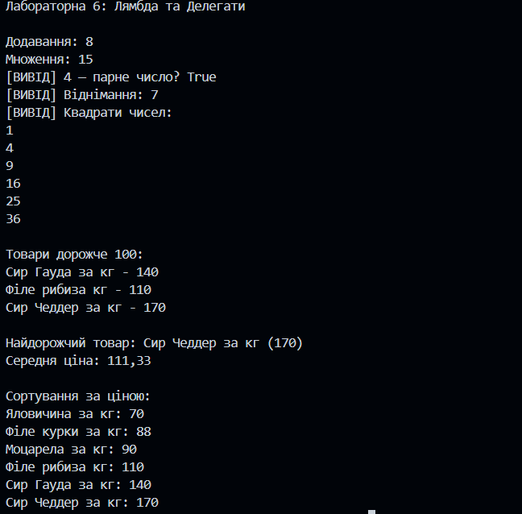

## Лабораторна робота №6

### Тема: Делегати, анонімні методи, лямбда-вирази та LINQ
### Мета роботи:
Метою є закріплення знань про делегати, анонімні методи, лямбда-вирази, а також стандартні делегати Func<>, Action<>, Predicate<>.
У роботі було створено консольний проєкт, у якому реалізовано приклади застосування різних типів делегатів та їхню взаємодію з LINQ:

 ### Опис
    У роботі реалізовано предметну область “Лямбда та Делегати”, де:
    1. Оголошено власний делегат Operation для арифметичних операцій.
    2. Продемонстровано використання анонімних методів та лямбда-виразів для реалізації додавання і множення.
    3. Використано стандартні делегати: Predicate<T>, Action<T>, Func<T1, T2, TResult> для перевірки, виводу та обчислень.
    4. Реалізовано роботу з колекціями List<int> та List<Product>, включаючи фільтрацію, сортування, обчислення середніх значень та пошук максимального.
    5. Для обробки колекцій застосовано LINQ (Where, Select, OrderBy, Max, Average).
    6. Створено клас Product із властивостями Name, Price, Category та використано його для демонстрації операцій над колекцією товарів.

### Приклад роботи:

    ### Висновок:
    У ході виконання лабораторної роботи я закріпив знання з теми делегатів, анонімних методів та лямбда-виразів, навчився використовувати стандартні делегати Func<>, Action<>, Predicate<>.
    Практична частина дозволила застосувати лямбда-вирази та LINQ для обробки колекцій: фільтрації, сортування, пошуку та обчислення агрегованих значень.
    Робота допомогла краще зрозуміти, як делегати і лямбда-вирази підвищують гнучкість і повторне використання коду
