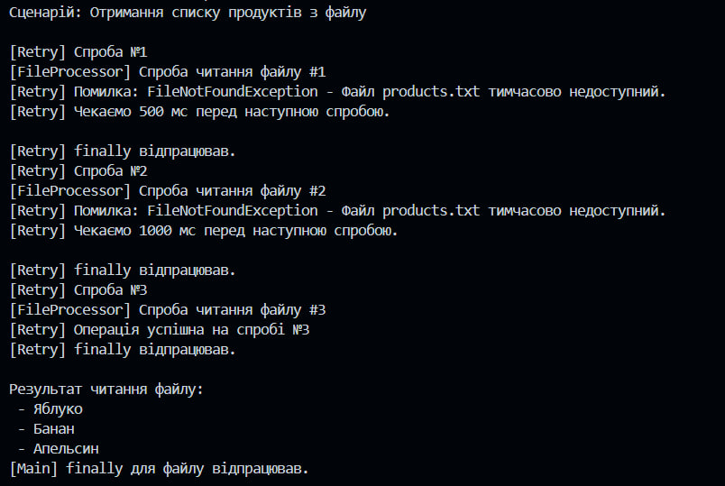
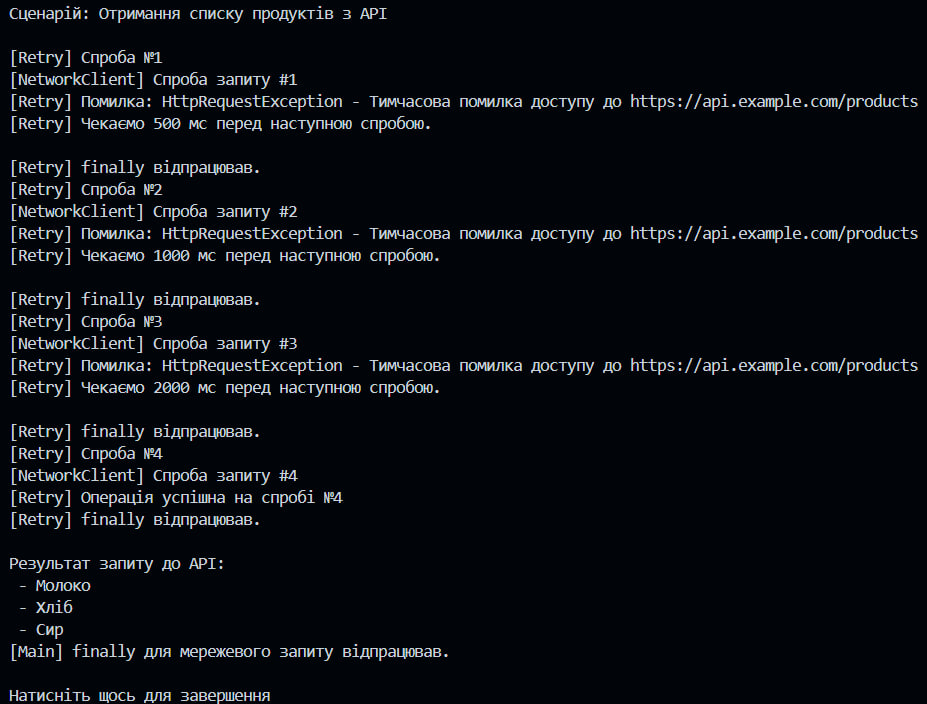

## Практична робота №7

### Тема: Обробка IO/мережевих помилок та патерн Retry
### Мета: 
 Метою лабораторної роботи є ознайомлення з механізмами обробки винятків у C#, зокрема помилок вводу/виводу та мережевих помилок, а також реалізація патерну Retry для підвищення відмовостійкості застосунків.
 У ході роботи було реалізовано консольний проєкт, у якому продемонстровано використання блоків try-catch-finally, повторних спроб виконання операцій та експоненційної затримки між ними.

 ### Опис
    У лабораторній роботі реалізовано навчальну предметну область “Отримання списку продуктів”, де:
    1. Створено клас FileProcessor, який імітує роботу з файлами та може викидати винятки FileNotFoundException і IOException.
    2. Створено клас NetworkClient, який імітує мережеві запити та може викидати виняток HttpRequestException.
    3. Реалізовано узагальнений допоміжний клас RetryHelper, що містить метод
    ExecuteWithRetry<T> для повторного виконання операцій у разі тимчасових помилок.
    4. У класі RetryHelper реалізовано:
    логування кожної спроби виконання операції;
    експоненційне збільшення затримки між повторними спробами;
    можливість вибіркової обробки винятків за допомогою делегата shouldRetry.
    5. У методі Main продемонстровано роботу з файлами та мережевими запитами із використанням патерну Retry.
    6. Для обробки помилок застосовано конструкцію try-catch-finally.

### Приклад роботи
#### Отримання списку продуктів з файлу

    У цьому сценарії програма намагається зчитати список продуктів з файлу products.txt.
    Перші дві спроби завершуються винятком FileNotFoundException, що імітує тимчасову відсутність файлу.
    Метод RetryHelper перехоплює помилку та виконує повторні спроби з експоненційною затримкою.
    1 спроба: помилка FileNotFoundException, затримка 500 мс;
    2 спроба: помилка FileNotFoundException, затримка 1000 мс;
    3 спроба: операція виконується успішно.
    Після успішного виконання в консоль виводиться список продуктів, а блок finally підтверджує завершення операції незалежно від результату.

#### Отримання списку продуктів з API

    У цьому сценарії програма виконує імітований запит до API за адресою
    https://api.example.com/products.

    Перші три спроби завершуються винятком HttpRequestException, що імітує тимчасову мережеву помилку.
    Retry-механізм повторює спроби із поступовим збільшенням часу очікування:
    1 спроба: помилка, затримка 500 мс;
    2 спроба: помилка, затримка 1000 мс;
    3 спроба: помилка, затримка 2000 мс;
    4 спроба: операція виконується успішно.
    Після цього виводиться список продуктів, отриманих з API, а блок finally повідомляє про завершення мережевого сценарію.
### Висновок
    У ході виконання лабораторної роботи я навчився обробляти винятки вводу/виводу та мережеві винятки за допомогою механізму try-catch-finally.
    Було реалізовано патерн Retry, який дозволяє повторювати виконання операцій у разі тимчасових збоїв із застосуванням експоненційної затримки.
    Практичне завдання допомогло зрозуміти принципи підвищення надійності програм та гнучкого керування повторними спробами виконання операцій.